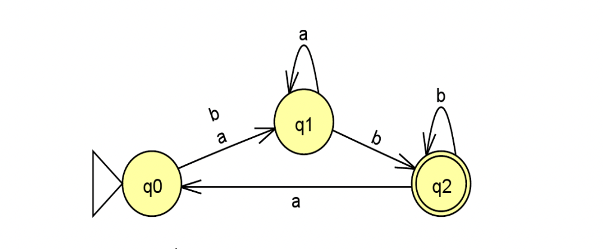

# Universal Finite Automata Simulator

This project was created with the purpose of recreating a deterministic finite automaton and a non-deterministic finite automaton. And, from an input determine if the string list is valid("aceita") or rejected("rejeita") by the machine.

## Example of an AFD Machine

